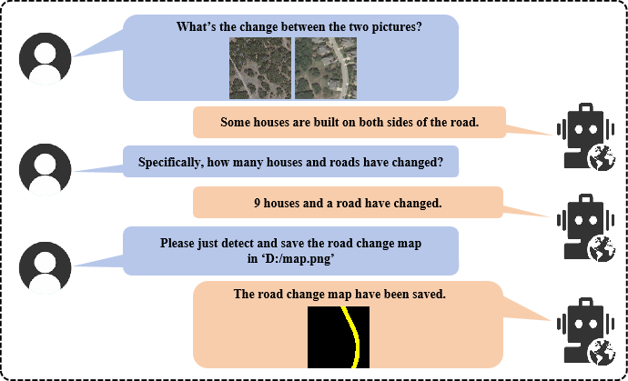
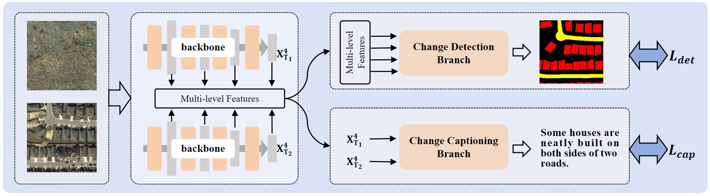
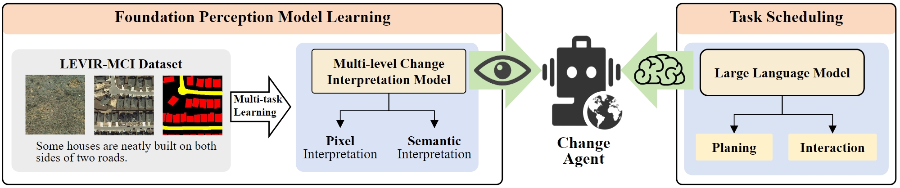
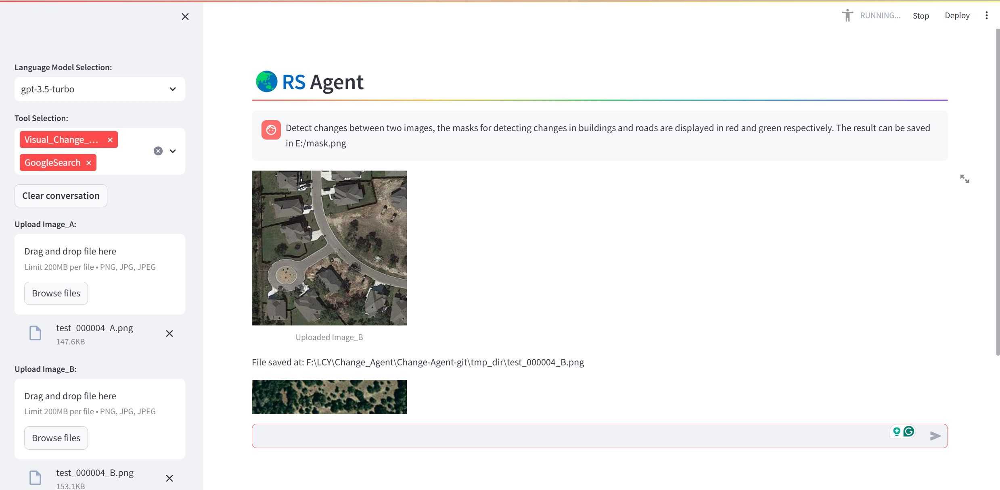

<div align="center">
    
<h1><a href="https://ieeexplore.ieee.org/document/10591792">Change-Agent: Toward Interactive Comprehensive Remote Sensing Change Interpretation and Analysis</a></h1>

**[Chenyang Liu](https://chen-yang-liu.github.io/), [Keyan Chen](https://kyanchen.github.io), [Haotian Zhang](https://scholar.google.com/citations?user=c7uR6NUAAAAJ), [Zipeng Qi](https://scholar.google.com/citations?user=KhMtmBsAAAAJ), [Zhengxia Zou](https://scholar.google.com.hk/citations?hl=en&user=DzwoyZsAAAAJ), and [Zhenwei Shi*✉](https://scholar.google.com.hk/citations?hl=en&user=kNhFWQIAAAAJ)**

<div align="center">
  
</div>
</div>

## Share us a :star: if you're interested in this repo

Official PyTorch implementation of the paper: "**Change-Agent: Toward Interactive Comprehensive Remote Sensing Change Interpretation and Analysis**" in [[IEEE](https://ieeexplore.ieee.org/document/10591792)]  ***(Accepted by IEEE TGRS 2024)***

## News

- 2024-06: The code is **available**.
- 2024-03: The paper is **available**.

## Table of Contents
- [LEVIR-MCI dataset](#LEVIR-MCI-dataset)
- [Training of MCI model](#Training-of-the-multi-level-change-interpretation-model)
- [Construction of Change-Agent](#Construction-of-Change-Agent)
- [Citation](#Citation)

## LEVIR-MCI dataset 
- Download the LEVIR_MCI dataset: [LEVIR-MCI](https://huggingface.co/datasets/lcybuaa/LEVIR-MCI/tree/main) (**Available Now!**).
- This dataset is an extension of our previously established [LEVIR-CC dataset](https://github.com/Chen-Yang-Liu/RSICC). It contains bi-temporal images as well as diverse change detection masks and descriptive sentences. It provides a crucial data foundation for exploring multi-task learning for change detection and change captioning.
    <br>
    <div align="center">
      
    </div>
    <br>
## Training of the multi-level change interpretation model
The overview of the MCI model:
<br>
    <div align="center">
      
    </div>
<br>

### Preparation
    
- **Environment Installation**:
    <details open>
    
    **Step 1**: Create a virtual environment named `Multi_change_env` and activate it.
    ```python
    conda create -n Multi_change_env python=3.9
    conda activate Multi_change_env
    ```
    
    **Step 2**: Download or clone the repository.
    ```python
    git clone https://github.com/Chen-Yang-Liu/Change-Agent.git
    cd ./Change-Agent/Multi_change
    ```
    
    **Step 3**: Install dependencies.
    ```python
    pip install -r requirements.txt
    ```
    </details>

- **Download Dataset**:
  <details open>
      
  Link: [LEVIR-MCI](https://huggingface.co/datasets/lcybuaa/LEVIR-MCI/tree/main). The data structure of LEVIR-MCI is organized as follows:

    ```
    ├─/DATA_PATH_ROOT/Levir-MCI-dataset/
            ├─LevirCCcaptions.json
            ├─images
                 ├─train
                 │  ├─A
                 │  ├─B
                 │  ├─label
                 ├─val
                 │  ├─A
                 │  ├─B
                 │  ├─label
                 ├─test
                 │  ├─A
                 │  ├─B
                 │  ├─label
    ```
    where folder ``A`` contains pre-phase images, folder ``B`` contains post-phase images, and folder ``label`` contains the change detection masks.
    </details>

- **Extract text files for the descriptions of each image pair in LEVIR-MCI**:

    ```
    python preprocess_data.py
    ```
    After that, you can find some generated files in `./data/LEVIR_MCI/`. 

### Train
Make sure you performed the data preparation above. Then, start training as follows:
```python
python train.py --train_goal 2 --data_folder /DATA_PATH_ROOT/Levir-MCI-dataset/images --savepath ./models_ckpt/
```

### Evaluate
```python
python test.py --data_folder /DATA_PATH_ROOT/Levir-MCI-dataset/images --checkpoint {checkpoint_PATH}
```
We recommend training the model 5 times to get an average score.

### Inference
Run inference to get started as follows:
```python
python predict.py --imgA_path {imgA_path} --imgB_path {imgA_path} --mask_save_path ./CDmask.png
```
You can modify ``--checkpoint`` of ``Change_Perception.define_args()`` in ``predict.py``. Then you can use your own model, of course, you also can download our pretrained model ``MCI_model.pth`` here: [[Hugging face](https://huggingface.co/lcybuaa/Change-Agent/tree/main)]. After that, put it in `./models_ckpt/`.


## Construction of Change-Agent
<br>
<div align="center">
      
</div>

- **Agent Installation**:
    ```python
    cd ./Change-Agent/lagent-main
    pip install -e .[all]
    ```
- **Run Agent**:

    cd into the ``Multi_change`` folder:
    ```python
    cd ./Change-Agent/Multi_change
    ```
    (1) Run Agent Cli Demo:
    ```bash
    # You need to install streamlit first
    # pip install streamlit
    python try_chat.py
    ```
        
    (2) Run Agent Web Demo:
    ```bash
    # You need to install streamlit first
    # pip install streamlit
    streamlit run react_web_demo.py
    ```
    <br>
    <div align="center">
          
    </div>

## Citation
If you find this paper useful in your research, please consider citing:
```
@ARTICLE{Liu_Change_Agent,
  author={Liu, Chenyang and Chen, Keyan and Zhang, Haotian and Qi, Zipeng and Zou, Zhengxia and Shi, Zhenwei},
  journal={IEEE Transactions on Geoscience and Remote Sensing}, 
  title={Change-Agent: Toward Interactive Comprehensive Remote Sensing Change Interpretation and Analysis}, 
  year={2024},
  volume={},
  number={},
  pages={1-1},
  keywords={Remote sensing;Feature extraction;Semantics;Transformers;Roads;Earth;Task analysis;Interactive Change-Agent;change captioning;change detection;multi-task learning;large language model},
  doi={10.1109/TGRS.2024.3425815}}

```

## Acknowledgement
Thanks to the following repository:

[RSICCformer](https://github.com/Chen-Yang-Liu/RSICC); [Chg2Cap](https://github.com/ShizhenChang/Chg2Cap); [lagent](https://github.com/InternLM/lagent)

## License
This repo is distributed under [MIT License](https://github.com/Chen-Yang-Liu/Change-Agent/blob/main/LICENSE.txt). The code can be used for academic purposes only.

## Contact Us
If you have any other questions❓, please contact us in time 👬
