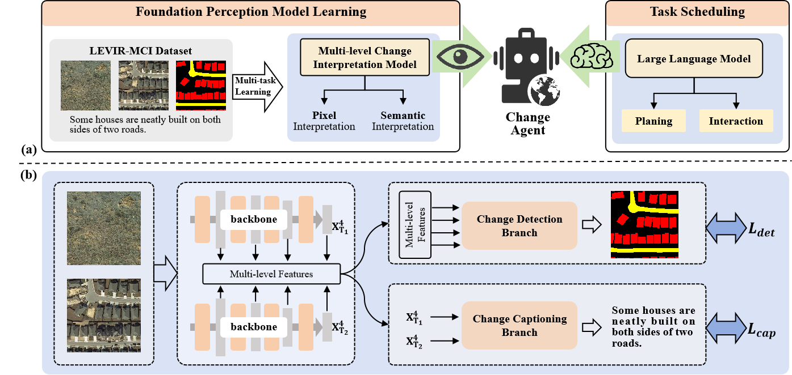

<div align="center">
    
<h1><a href="https://ieeexplore.ieee.org/document/10591792">Change-Agent: Towards Interactive Comprehensive Remote Sensing Change Interpretation and Analysis</a></h1>

**[Chenyang Liu](https://chen-yang-liu.github.io/), [Keyan Chen](https://kyanchen.github.io), [Haotian Zhang](https://scholar.google.com/citations?user=c7uR6NUAAAAJ), [Zipeng Qi](https://scholar.google.com/citations?user=KhMtmBsAAAAJ), [Zhengxia Zou](https://scholar.google.com.hk/citations?hl=en&user=DzwoyZsAAAAJ), and [Zhenwei Shi*✉](https://scholar.google.com.hk/citations?hl=en&user=kNhFWQIAAAAJ)**

</div>

## Share us a :star: if you're interested in this repo

This repository contains the official PyTorch implementation of the paper: "**Change-Agent: Towards Interactive Comprehensive Remote Sensing Change Interpretation and Analysis**" in [[IEEE](https://ieeexplore.ieee.org/document/10591792)]  ***(Accepted by IEEE TGRS 2024)***

<div align="center">
  
</div>

## LEVIR-MCI dataset 
- Download the LEVIR_MCI dataset: [LEVIR-MCI](https://huggingface.co/datasets/lcybuaa/LEVIR-MCI/tree/main) (**Available Now!**).
- The dataset contains bi-temporal images as well as diverse change detection masks and descriptive sentences. It provides a crucial data foundation for exploring multi-task learning for change detection and change captioning.
    <br>
    <div align="center">
      
    </div>
    <br>
## Training of the multi-level change interpretation model
- The training code of the MCI model will be available **before July 31st**.
    <div align="center">
      
    </div>
## Construction of Change-Agent
- The code will be available
    <br>
    <div align="center">
      
    </div>


## Citation & Acknowledgments
If you find this paper useful in your research, please consider citing:
```
@ARTICLE{Liu_Change_Agent,
  author={Liu, Chenyang and Chen, Keyan and Zhang, Haotian and Qi, Zipeng and Zou, Zhengxia and Shi, Zhenwei},
  journal={IEEE Transactions on Geoscience and Remote Sensing}, 
  title={Change-Agent: Towards Interactive Comprehensive Remote Sensing Change Interpretation and Analysis}, 
  year={2024},
  volume={},
  number={},
  pages={1-1},
  keywords={Remote sensing;Feature extraction;Semantics;Transformers;Roads;Earth;Task analysis;Interactive Change-Agent;change captioning;change detection;multi-task learning;large language model},
  doi={10.1109/TGRS.2024.3425815}}

```
