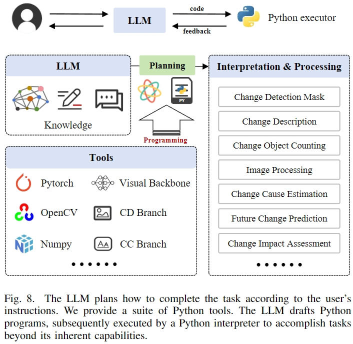

    <h2>
        Change-Agent: Towards Interactive Comprehensive Remote Sensing Change Interpretation and Analysis
    </h2>

 

  

    <a href="https://ieeexplore.ieee.org/document/10591792">
    IEEE TGRS
  </a>

  <a href="https://arxiv.org/abs/2403.19646">
    ArXiv
  </a>
    

**The dataset and code:**
- Download the LEVIR_MCI dataset: [LEVIR-MCI](https://huggingface.co/datasets/lcybuaa/LEVIR-MCI/tree/main) (**Available Now!**).
- Code is coming soon.

## Share us a :star: if you're interested in this repo

This repository will provide the following: 
- **LEVIR-MCI dataset**. The dataset contains bi-temporal images as well as diverse change detection masks and descriptive sentences. It provides a crucial data foundation for exploring multi-task learning for change detection and change captioning.
     
    

      
    

     
- **Training of the multi-level change interpretation model**.
    

      
    

- **Construction of Change-Agent**. 
     
    

      
    

[//]: # (## Contributions)

[//]: # (- **Decoupling Paradigm**: The previous methods predominantly adhere to the encoder-decoder framework directly borrowed from the image captioning field, overlooking the specificity of the RSICC task. Unlike that, we propose a decoupling paradigm to decouple the RSICC task into two issues: whether and what changes have occurred. Specifically, we propose a pure Transformer-based model in which an image-level classifier and a feature-level encoder are employed to address the above two issues. The experiments validate the effectiveness of our approach. Furthermore, in Section IV-G, we discuss the advantages of our decoupling paradigm to demonstrate that the new paradigm has a broad prospect and is more proper than the previous coupled paradigm for the RSICC task.)

[//]: # (- **Integration of prompt learning and pre-trained large language models**: To our knowledge, we are the **first** to introduce prompt learning and the LLM into the RSICC task. To fully exploit their potential in the RSICC task, we propose a multi-prompt learning strategy which can effectively exploit the powerful abilities of the pre-trained LLM, and prompt the LLM to know whether changes exist and generate captions. Unlike the previous methods, our method can generate plausible captions without retraining a language decoder from scratch as the caption generator. Lastly, with the recent emergence of various LLMs, we believe that LLMs will attract broader attention in the remote sensing community in the forthcoming years. We aspire for our paper to inspire future advancements in remote sensing research.)

[//]: # (- **Experiments**: Experiments show that our decoupling paradigm and the multi-prompt learning strategy are effective and our model achieves SOTA performance with a significant improvement. Besides, an additional experiment demonstrates our decoupling paradigm is more proper than the previous coupled paradigm for the RSICC task.)

